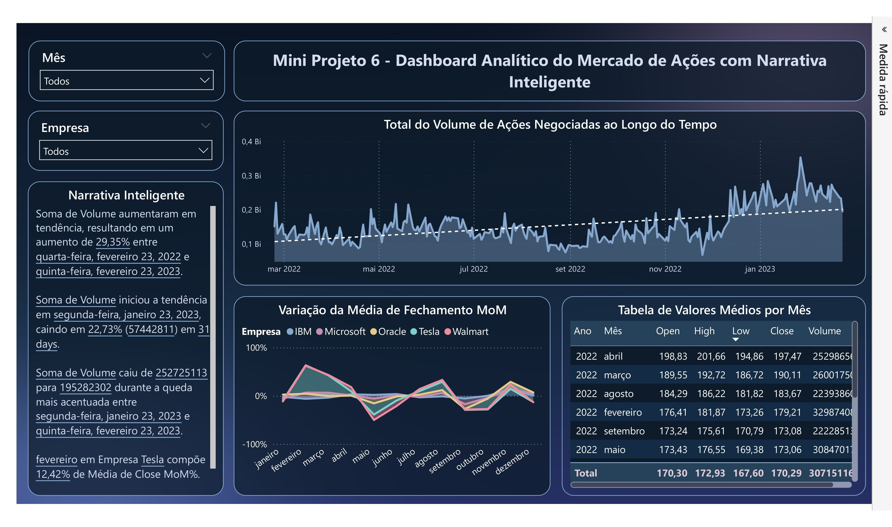

#  Dashboard Analítico do Mercado de Ações com Power BI

Mini projeto desenvolvido no **Power BI** com o objetivo de analisar dados do mercado de ações e transformar informações financeiras em visualizações interativas e indicadores de fácil interpretação.

O dashboard utiliza recursos de análise temporal, comparação entre empresas e **Narrativa Inteligente**, permitindo explorar os dados de diferentes formas.

##  Objetivo

Desenvolver um dashboard analítico capaz de apresentar informações sobre o comportamento do mercado de ações, facilitando a identificação de tendências, variações e diferenças entre empresas ao longo do tempo.

##  Dashboard

### Principais análises

* Volume de ações negociadas ao longo do tempo;
* Variação da média de fechamento mês a mês (MoM);
* Valores médios de abertura, máxima, mínima e fechamento;
* Comparação entre diferentes empresas;
* Evolução dos indicadores ao longo dos meses;
* Análise de tendências;
* Narrativa Inteligente com informações e variações relevantes.

##  Interatividade

O dashboard conta com filtros que permitem explorar os dados por:

* **Mês**
* **Empresa**

A combinação dos filtros permite realizar análises mais específicas e observar o comportamento de cada empresa ao longo do período.

##  Narrativa Inteligente

Um dos principais recursos utilizados no projeto foi a **Narrativa Inteligente**, utilizada para transformar os resultados apresentados no dashboard em informações textuais.

A narrativa destaca, entre outros pontos:

* Tendências de crescimento e queda;
* Variações percentuais;
* Períodos de maior movimentação;
* Comportamento do volume negociado;
* Participação das empresas nas médias analisadas.

##  Ferramentas e recursos utilizados

* **Power BI Desktop**
* **DAX**
* **Visualização de Dados**
* **Narrativa Inteligente**
* **Filtros e segmentações**
* **Análise temporal**
* **Indicadores financeiros**

##  Aprendizados

Durante o desenvolvimento deste projeto, pratiquei a construção de dashboards voltados para análise financeira, trabalhando não apenas a apresentação dos dados, mas também a identificação de tendências e variações.

O projeto também permitiu aprofundar o uso de recursos do Power BI para tornar a análise mais **interativa, visual e orientada à interpretação dos dados**.

##  Autora

**Nicolly Alcântara**

Formada em Análise e Desenvolvimento de Sistemas, com foco no desenvolvimento de conhecimentos em **Análise de Dados, Power BI, Excel e SQL**.

🔗 [Portfólio](https://nicollyoalcantara.github.io/#contato)
🔗 [LinkedIn](https://www.linkedin.com/in/nicollyalcantara)
